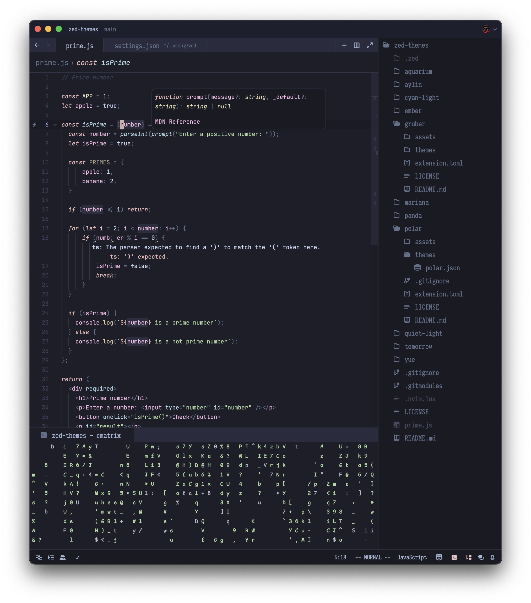

# Aquarium
`variants: [Dark, Light]`

A colorful, dark, cozy Zed port of the [Aquarium](https://github.com/FrenzyExists/aquarium-vim/tree/develop) theme.

## Preview

## Installation
1. Copy aquarium.json to ~/.config/zed/themes/
2. Open Zed and navigate to Settings -> Theme -> Aquarium
